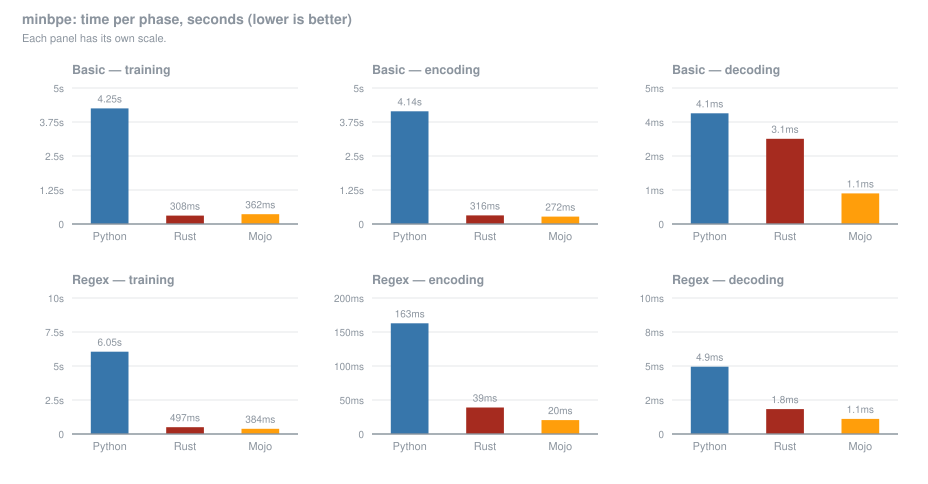

# Benchmarks

## What this is

`minbpe` has been ported to several languages. This directory runs the *same*
workload against three of them so the numbers are at least comparable to each
other:

| | implementation | version |
|---|---|---|
| Mojo | this repository | Mojo 1.0.0 (`ed45d567`) |
| Python | [karpathy/minbpe](https://github.com/karpathy/minbpe) — the original | commit `1acefe8`, CPython 3.14.7, `regex` 2026.7.19 |
| Rust | [gnp/minbpe-rs](https://github.com/gnp/minbpe-rs) by Gregor Purdy | rev `b69dfa9`, rustc 1.98.0, release + LTO |

The workload is the one from the original repository: train a 512 token
vocabulary on the text of Taylor Swift's Wikipedia page
(`tests/taylorswift.txt`, 186 KB), then encode and decode that same text. Both
tokenizers are measured, `BasicTokenizer` and `RegexTokenizer`, and the three
phases are timed separately.

Each figure is the mean of **10 timed rounds after 2 warmup rounds**. Every
training round runs on a freshly constructed tokenizer, because `train` appends
to the merge rules rather than replacing them — reusing one tokenizer would
accumulate 256 extra rules per round and quietly inflate both training and
encoding.

Measured on a **MacBook Pro (Mac14,9), Apple M2 Pro, 10 cores (6P + 4E), 16 GB,
macOS 26.6.2**.

One machine, one input, one vocabulary size, three independently written
programs, all single-threaded. Just an orientation, not a fully blown benchmark. 

## Running them

The Mojo benchmark runs in the default environment:

```bash
pixi run bench            # writes benchmarks/results/mojo.json
```

The two reference benchmarks live in a separate pixi environment, so a normal
install of this project stays Mojo-only:

```bash
pixi run -e bench setup-reference   # clones minbpe into ./.reference
pixi run -e bench bench-python      # writes benchmarks/results/python.json
pixi run -e bench bench-rust        # writes benchmarks/results/rust.json
```

Notes:

- `bench-rust` needs a **system `cargo`** — the Rust toolchain is deliberately
  not pulled into the pixi environment. The crate in `rs/` fetches minbpe-rs
  from git at a pinned revision.
- `setup-reference` is needed only for `bench-python`. The Python original has
  no packaging metadata upstream, so it cannot be `pip install`ed; the script
  looks for it as an importable module, then `$MINBPE_PATH`, then
  `<repo>/.reference/minbpe`.
- The bench environment also pulls in `tiktoken`, only because minbpe's
  `__init__` imports `GPT4Tokenizer`. The benchmark never uses it.
- All three resolve paths relative to their own source file, so they can be run
  from any working directory.

To change the round counts, edit `TEST_ROUNDS` / `WARMUP_ROUNDS` at the top of
`benchmark.mojo`, `benchmark.py` and `rs/src/main.rs` — they must match across
all three for the comparison to hold.

## Results

Times in seconds, lower is better. The last two columns are how many times
faster Mojo is than the other two; below 1.00x means Mojo is slower.

| | Python | Rust | Mojo | Mojo vs Python | Mojo vs Rust |
|---|---:|---:|---:|---:|---:|
| Basic — training | 3.8779 | 0.3116 | 0.4329 | 9.0x | 0.72x |
| Basic — encoding | 4.1180 | 0.3218 | 0.3437 | 12.0x | 0.94x |
| Basic — decoding | 0.0040 | 0.0031 | 0.0057 | 0.7x | 0.54x |
| Basic — total | 7.9999 | 0.6365 | 0.7823 | 10.2x | 0.81x |
| Regex — training | 6.3207 | 0.4817 | 0.4407 | 14.3x | 1.09x |
| Regex — encoding | 0.1678 | 0.0388 | 0.0657 | 2.6x | 0.59x |
| Regex — decoding | 0.0050 | 0.0018 | 0.0063 | 0.8x | 0.29x |
| Regex — total | 6.4935 | 0.5224 | 0.5127 | 12.7x | 1.02x |
| Overall | 14.4934 | 1.1589 | 1.2951 | 11.2x | 0.89x |

### Per-phase comparison



Regenerate with `pixi run chart` after re-running the benchmarks.

The raw figures are in `results/{mojo,python,rust}.json`, regenerated by the
commands above.
